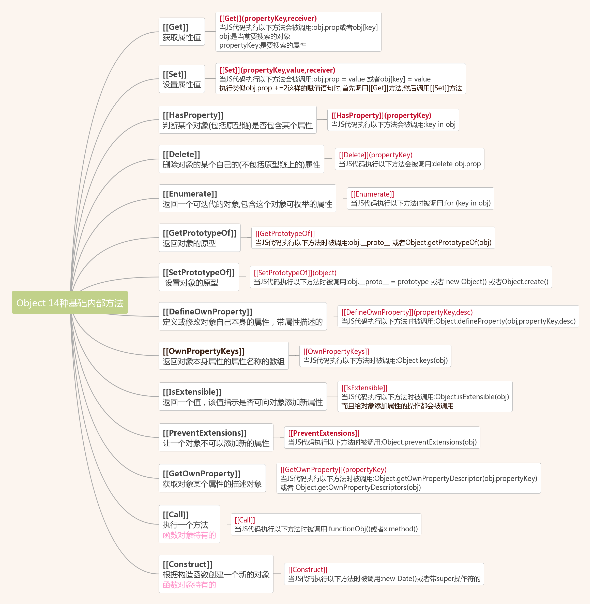

## 对象 - 属性的无序集合
- javascript内置对象特性可参考（W3C-[ES5/标准 ECMAScript 内置对象]( https://www.w3.org/html/ig/zh/wiki/ES5/%E6%A0%87%E5%87%86_ECMAScript_%E5%86%85%E7%BD%AE%E5%AF%B9%E8%B1%A1)）
### 对象的三种属性
- 数据属性：包含一个值,这种属性就是我们通常所用的"普通"属性,它用来将一个字符串名称映射到某个值上。
- 访问器属性：不包含值而是定义了一个当属性被读取时调用的函数（getter）和一个当属性被写入时调用的函数（setter）
- 内部属性：内部属性(方法)无法通过JavaScript代码直接访问到,但是它们的确存,并且定义了代码执行时的行为,影响着程序的表现，所有的内部属性都用双重中括号[[name]]来标注。
  - 
### 检测属性
  - if: if方法不能判断值为 否 的属性，如 0，false， null
  - in: in方法将遍历所有自有属性与原型属性，不会评估属性值，对性能有益
  - hasOwnProperty(): 只会检查自有属性，不会检测到原型属性
### 给对象定义属性
  1. 新增属性： 当对象新增一个属性时，javascript将调用[[Put]] ([[Put]]方法默认创建数据属性)的内部方法在对象上创建一个新节点来保存属性`（会定义初始值和属性的特征）`
  2. 属性修改： 当已有属性被赋值新值时，javasctipt将调用[[Set]]的内部方法将当前值替换为新值
### 删除属性
  - delete delete将调用对象内部方法[[Delete]]彻底删除属性（某些属性无法被移出）
    例： delete testObject.name
### 属性的特性
  - 一个属性的所有状态,包括它的数据和元数据,都存储在该属性的特性(attributes)中.属性拥有自己的特性,就像对象拥有自己的属性一样.特性的名称经常写成类似内部属性的形式(双中括号)，不能被直接访问.
#### 数据属性特征、访问器属性特征
  - 数据属性与访问器属性的共有特征
    1. [[Enumerable]] ： 存储着一个布尔值.标识该属性是否可枚举
       - 可用propertyIsEnumerable()检查属性是否可枚举
         例： testObject.propertyIsEnumerable(name)
       1. for (x in Object) {}
          会遍历原型属性与自有属性的可枚举属性
       2. Object.key()
          只会返回自有属性的可枚举属性的key,
    2. [[Configurable]] ： 存储着一个布尔值,是否可配置该属性（是否可删除可修改该属性类型）
       - 不可把一个不可配置的属性变成可配置的属性
  - 数据属性：
    - [[Put]]方法默认创建数据属性
      ```
      Object.defineProperty(obj, '属性名', {value: xx, enumerable: true, configurable: true, writable: true})
      ```
    - 数据属性两个特有的特征
      1. [ [Value] ]: 存储着属性的值,也就是属性的数据.
      2. [ [Writable] ]: 该特征为一个布尔值,表明该属性的值是否可以改变.
    - 数据属性不仅可以直接访问，也可以通过定义的访问器来专门访问
  - 访问器属性：
    - 定义当属性被读取时调用的函数(getter)或属性被写入时调用的函数(settr)
    - 改变属性特征(Object.defineProperty)
      ```
      Object.defineProperty(obj, '属性名', {enumerable: true, configurable: true, get: function(){xxxxx}, set: function(){xxxx}})
      ```
    - 访问属性两个特有的特征
      1. [[Get]]：内涵getter函数,也就是在读取这个属性时调用的函数.该函数返回的值也就是这个属性的值
      2. [[Set]]：内涵setter函数,也就是在为这个属性赋值时调用的函数.该函数在调用时会被传入一个参数,参数的值为所赋的那个新值.
  - 获取属性的特征
    - Object.getOwnPropertyDescriptor(obj, name)
      - 接受两个参数: 属性所在的对象、属性名
  - 定义属性的特征
    - 属性描述符/对象(property descriptor)：属性描述符具有和内部特征同名的属性但名字中不包含中括号，该对象的每个属性都对应着所属属性的一个特性。
    - 添加或修改一个属性和对应的属性描述符: Object.defineProperty(obj, propName, propDesc)
      ```
      Object.defineProperty(obj, '属性名', {
        value: xx,
        enumerable: true,
        configurable,
        writable: true
      });
      ```
      - defineProperty方法接受三个参数：拥有该属性的对象、属性名、属性的描述符
      - 当属性不存在时，将创建属性
      - 当属性存在时，只有指定的特征会被改变
      - 使用defineProperty创建属性时，布尔类型的特征不被指定时会被默认设置为false
    - Object.defineProperties：定义多个属性
      ```
      Object.defineProperties(obj, {'属性名', {value: xx, enumerable: true, configurable, writable: true}...})
      ```
### 禁止修改对象的三种方法
  #### 禁止扩展
  - [[Extensible]] 指明是否可向该对象添加自身属性
  - Object.preventExtensions 指定一个对象为不可扩展的对象
    - 将对象内部属性[[Extensible]]置为false
    - 无法再给目标对象添加新属性或删除属性
  - Object.isExtensible() 检查对象的[[Extensible]]值
  ```
    var person = { name: 'xyz'};
    console.log(Object.isExtensible(person));   // true
    Object.preventExtensions(person);
    console.log(Object.isExtensible(person));   // false
  ```
  #### 对象封印
  - Object.seal(obj) 指定一个对象为被封印的对象
    - 将对象内部属性[[Extensible]]置为false
      - 无法再给目标对象添加新属性或删除属性
    - 将对象所有属性的[[Configurable]]特征置为false
      - 目标对象所有属性特性都不可配置(不可修改属性类型)
    - 只能读写对象属性。
  - Object.isSealed(obj)判断一个对象是否被封印
  ```
  var person = { name: 'xyz' };
  console.log(Object.isSealed(person));       // false
  Object.seal(person);
  console.log(Object.isSealed(person));       // true
  console.log(Object.isExtensible(person));   // false
  person.name = 'abc';
  console.log(person.name);   // abc
  ```
  #### 对象冻结
  - Object.freeze(obj) 指定一个对象为被冻结的对象
  - 将对象内部属性[[Extensible]]置为false
    - 无法再给目标对象添加新属性或删除属性
  - 将对象所有属性的[[Configurable]]特征置为false
    - 目标对象所有属性特性都不可配置(不可修改属性类型)
  - 只能读对象属性
  - Object.isFrozen(obj) 判断对象是否被冻结
  ```
  var person = { name: 'xyz' };
  console.log(Object.isFrozen(person));       // false
  Object.freeze(person);
  console.log(Object.isSealed(person));       // true
  console.log(Object.isFrozen(person));       // true
  console.log(Object.isExtensible(person));   // false
  person.name = 'abc';
  console.log(person.name);   // xyz
  ```

### ES5（W3C）规范中关于对象属性的描述
- W3C-[对象属性及属性特性](https://www.w3.org/html/ig/zh/wiki/ES5/%E7%B1%BB%E5%9E%8B#Object_.E7.B1.BB.E5.9E.8B)
- 对象的三种属性
  1. 命名数据属性： 由一个名字与一个 ECMAScript语言类型 值和一个 Boolean 属性集合组成。
  2. 命名访问器属性： 由一个名字与一个或两个访问器函数，和一个 Boolean 属性集合组成。访问器函数用于存取一个与该属性相关联的 ECMAScript语言类型 值
  3. 内部属性： 没有名字，且不能直接通过 ECMAScript 语言操作。内部属性的存在纯粹为了规范的目的。
#### 非内部属性
##### 属性的特性
  - 本规范中的特性用于定义和解释命名属性的状态。
##### 命名数据属性的特性
| 特性名称 | 取值范围 | 描述 |
| - | - | - |
| [[Value]]        | 任何 ECMAScript语言类型 | 通过读属性来取到该值 |
| [[Writable]]     | Boolean  |  如果为 false，试图通过 ECMAScript 代码 [[Put]] 去改变该属性的 [[Value]]，将会失败 |
| [[Enumerable]]   | Boolean  |  如果为 true，则该属性可被 for-in 枚举出来，否则，该属性不可枚举。 |
| [[Configurable]] | Boolean  |  如果为 false，试图删除该属性或改变该属性为访问器属性，或改变它的特性（除了 [[Value]]），都会失败。 |
##### 命名访问器属性的特性
| 特性名称            | 取值范围             | 描述 |
| - | - | - |
| [[Get]]	          | Object 或 Undefined  | 如果该值为一个 Object 对象，那么它必须是一个函数对象。每次有对属性进行 get 访问时，该函数的内部方法 [[Call]] 会伴随着一个空参数列表被调用，并返回该属性值。 |
| [[Set]]           | Object 或 Undefined  | 如果该值为一个 Object 对象，那么它必须是一个函数对象。每次有对属性进行 set 访问时，该函数的内部方法 [[Call]] 会伴随着一个参数列表被调用，这个参数列表包含了指定值作为唯一的参数。属性的内部方法 [[Set]] 可能会对随后的 属性 内部方法 [[Get]] 的调用返回结果产生影响。 |
| [[Enumerable]]    | Boolean             | 如果为 true，则该属性可被 for-in 枚举出来，否则，该属性不可枚举。 |
| [[Configurable]]  | Boolean	            | 如果为 false，试图删除该属性，改变该属性为数据属性，或改变它的特性，都会失败。 |
##### 默认的特性值
  - 如果在此规范中没有对某个命名属性的特性做出明确指定，那么它的默认值将使用下表的定义。
    | 名称                | 默认值      |
    | -                  | -          |
    | [[Value]]          | undefined  |
    | [[Get]]            | undefined  |
    | [[Set]]	           | undefined  |
    | [[Writable]]       | false      |
    | [[Enumerable]]     | false      |
    | [[Configurable]]   | false      |
#### 内部属性及方法
  - 内部属性的名字用闭合双方括号“[[ ]]”括起来。如果一个算法使用一个对象的一个内部属性，而此对象并没有实现需要的内部属性，那么就抛出 TypeError 异常。
  - 所有对象共有的内部属性
    |内部属性|值的类型范围|说明|
    |-|-|-|
    | [[Prototype]]	     | Object或Null             |  此对象的原型  |
    | [[Class]]	         | String                   | 说明规范定义的对象分类的一个字符串值  |
    | [[Extensible]]	   | Boolean	                | 如果是 true，可以向对象添加自身属性。 |
    | [[Get]]	           | SpecOp(属性名) → 任意	    | 返回命名属性的值 |
    | [[GetOwnProperty]] | SpecOp(属性名) → Undefined 或 属性描述 |	返回此对象的自身命名属性的属性描述，如果不存在返回 undefined |
    | [[GetProperty]]	   | SpecOp(属性名) → Undefined 或 属性描述 |	返回此对象的完全填入的自身命名属性的属性描述，如果不存在返回 undefined |
    | [[Put]]	           | SpecOp(属性名, 任意, Boolean)	 | 将指定命名属性设为第二个参数的值。flag 控制失败处理。 |
    | [[CanPut]]	       | SpecOp(属性名) → Boolean	    |   返回一个 Boolean 值，说明是否可以在 属性名 上执行 [[Put]] 操作。 |
    | [[HasProperty]]	   | SpecOp (属性名) → Boolean	    | 返回一个 Boolean 值，说明对象是否含有给定名称的属性。 |
    | [[Delete]]	       | SpecOp(属性名, Boolean) → Boolean |	从对象上删除指定的自身命名属性。flag 控制失败处理。 |
    | [[DefaultValue]]	 | SpecOp(暗示) → 原始类型	          | 暗示是一个字符串 Question.png。返回对象的默认值 |
  - 只在某些对象中定义的内部属性
    |内部属性|值的类型范围|说明|
    |-|-|-|
    | [[PrimitiveValue]]	  | 原始类型	                        | 与此对象的内部状态信息关联。对于标准内置对象只能用 Boolean、Date、Number、String 对象实现 [[PrimitiveValue]]。 |
    | [[Construct]]	        | SpecOp (任意类型的列表) → Object	 | 通过 new 运算符调，创建对象。SpecOp 的参数是通过 new 运算符传的参数。实现了这个内部方法的对象叫做构造器。 |
    | [[Call]]	            | SpecOp (任意, 任意类型的列表) → 任意 或 引用  | 运行与此对象关联的代码。通过函数调用表达式调用。SpecOp 的参数是一个 this 对象和函数调用表达式传来的参数组成的列表。实现了这个内部方法的对象是可调用的。只有作为宿主对象的可调用对象才可能返回引用值。|
    | [[HasInstance]]	      | SpecOp (任意) → Boolean	        | 返回一个表示参数对象是否可能是由本对象构建的布尔值。在标准内置 ECMAScript 对象中只有 Function 对象实现 [[HasInstance]]。|
    | [[Scope]]	            | 词法环境         | 一个定义了函数对象执行的环境的词法环境。在标准内置 ECMAScript 对象中只有 Function 对象实现 [[Scope]]。|
    | [[FormalParameters]]  | Strings的列表    | 一个包含 Function 的 FormalParameterList 的标识符字符串的可能是空的列表。在标准内置 ECMAScript 对象中只有 Function 对象实现 [[FormalParameterList]] Question.png。|
    | [[Code]]	            | ECMAScript代码  | 函数的 ECMAScript 代码。在标准内置 ECMAScript 对象中只有 Function 对象实现 [[Code]]。|
    | [[TargetFunction]]	  | Object	       | 使用标准内置的 Function.prototype.bind 方法创建的函数对象的目标函数。只有使用 Function.prototype.bind 创建的 ECMAScript 对象才有 [[TargetFunction]] 内部属性。|
    | [[BoundThis]]	        | 任意	          |  使用标准内置的 Function.prototype.bind 方法创建的函数对象的预绑定的 this 值。只有使用 Function.prototype.bind 创建的 ECMAScript 对象才有 [[BoundThis]] 内部属性。|
    | [[BoundArguments]]    | 任意类型的列表	   |   使用标准内置的 Function.prototype.bind 方法创建的函数对象的预绑定的参数值。只有使用 Function.prototype.bind 创建的 ECMAScript 对象才有 [[BoundArguments]] 内部属性。|
    | [[Match]]	            | SpecOp(String,index)→MatchResult   | 测试正则匹配并返回一个 MatchResult 值。在标准内置 ECMAScript 对象中只有 RegExp 对象实现 [[Match]]。|
    | [[ParameterMap]]	    | Object	           | 提供参数对象的属性和函数关联的形式参数之间的映射。只有参数对象才有 [[ParameterMap]] 内部属性。|
